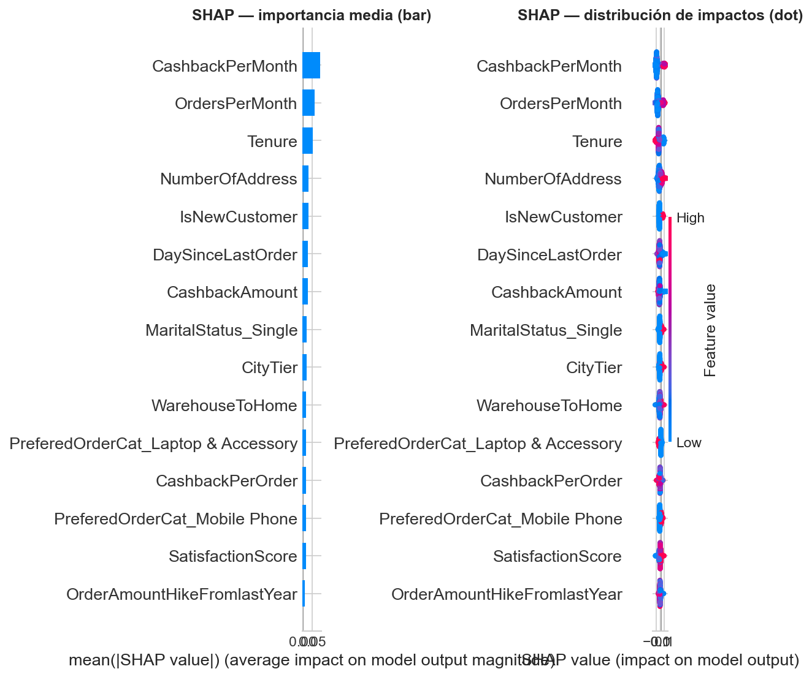
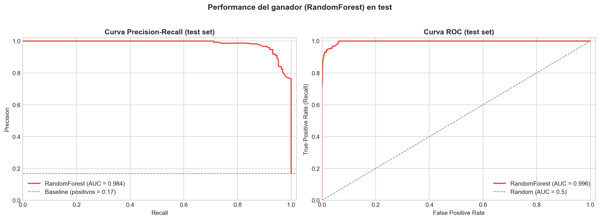

# Predicción de Churn de Clientes — Reporte Ejecutivo

> **Para:** Gerencia Comercial
> **Por:** Equipo de Análisis de Retención
> **Fecha:** Junio 2026
> **Dataset analizado:** 5,630 clientes de e-commerce

---

## TL;DR

- **El año pasado se nos fueron 945 clientes (17% de la base).** Los datos muestran que el churn no es aleatorio: tres factores explican la mayor parte del riesgo, y dos creencias del negocio sobre por qué se va la gente no se sostienen empíricamente.
- **Construimos una herramienta que detecta a 95 de cada 100 clientes que se van a ir, con tiempo para intervenir.** Sobre 1,126 clientes evaluados detectó 181 de 190 churners reales con 81% de aciertos en sus alertas.
- **Recomendación prioritaria:** reorientar las campañas de retención desde "días sin compra" hacia "tasa de actividad mensual relativa a la antigüedad" — el indicador que mejor predice el riesgo según los datos.

---

## 1. Problema de negocio

El año pasado cerca del 17% de los clientes activos dejaron de comprarnos. En términos económicos esto es relevante por dos razones simultáneas:

- **Adquirir un cliente nuevo cuesta entre 5 y 7 veces más que retener uno existente** (estándar de la industria). Cada churner que no detectamos a tiempo es un costo de adquisición que tenemos que afrontar para volver al mismo volumen de base.
- **Los clientes que se van suelen ser los que estaban a punto de generar valor recurrente** — un cliente que cumple su tercer mes de actividad típicamente vale más en los siguientes 12 meses que uno recién adquirido.

La pregunta concreta de Gerencia fue doble: **¿podemos detectar quiénes están por irse antes de que dejen de comprar?** y **¿qué los está empujando a irse?**

Este reporte responde ambas. Primero presenta lo que descubrimos sobre los factores que predicen el churn — incluyendo dos hallazgos contraintuitivos que cuestionan reglas históricas del equipo comercial. Después describe la herramienta de predicción que armamos y cómo integrarla a las operaciones de retención.

---

## 2. Qué encontramos

Sobre las 20 variables disponibles del comportamiento del cliente, analizamos cuáles realmente predicen el churn. Encontramos cuatro hallazgos accionables:

**1. El predictor más fuerte del riesgo es la tasa mensual de actividad relativa a la antigüedad.**

Un cliente con pocas órdenes y poco cashback recibido *en relación a cuántos meses lleva con nosotros* tiene riesgo muy alto. Esto es distinto a "pocas órdenes" en absoluto — un cliente nuevo con pocas órdenes puede ser saludable; uno con un año y pocas órdenes está claramente desenganchado. Las dos variables derivadas que construimos (órdenes por mes de antigüedad y cashback por mes de antigüedad) son los dos predictores más informativos del modelo, por encima de cualquier variable cruda.

*Implicancia:* la métrica que el equipo comercial debe monitorear para identificar riesgo no es "cuándo fue la última compra" sino "qué tan activo está este cliente para los meses que lleva con nosotros".

**2. La antigüedad sigue siendo crítica, y la ventana de los primeros 3 meses concentra el mayor riesgo.**

Los clientes nuevos (≤3 meses) tienen tasa de churn cercana al 50%, vs. menos del 10% en clientes con más de un año. Esto confirma lo que ya intuíamos pero ahora lo tenemos cuantificado: el onboarding es la ventana de máximo apalancamiento para retención.

*Implicancia:* las primeras 12 semanas son donde un programa estructurado de bienvenida + seguimiento + acompañamiento tiene mayor retorno.

**3. La regla histórica de "enviar email de reactivación a los 15 días sin compra" no se sostiene empíricamente.**

Cuando analizamos quiénes son los clientes que efectivamente churnean, encontramos algo inesperado: **los que se van compraron MÁS recientemente** que los que se quedan (mediana de 2 días sin comprar vs. 4 días en activos). Por sí solo, "días sin compra" no es señal de riesgo. La regla no debe seguir activa.

El patrón real que sí predice fuerte es **"compra reciente + queja sin resolver"** — ese segmento tiene 39% de churn vs 7% para "compra lejana + sin queja". El gatillo no es la inactividad; es la mala experiencia reciente.

*Implicancia:* dejar de gastar recursos en campañas masivas por inactividad y reorientarlos a atención one-on-one cuando aparece una queja en un cliente reciente.

**4. La satisfacción auto-reportada no es señal de retención.**

El score de satisfacción de 1 a 5 que recolectamos no predice el churn de forma confiable. De hecho, los clientes que se van reportan score **más alto** (3.4) que los que se quedan (3.0). El indicador puede estar inflado por sesgo de respuesta o medido en un momento que no captura la verdadera intención de seguir o irse.

*Implicancia:* no usar el score de satisfacción como gatillo para acciones de retención sin antes validar con el equipo de datos cuándo se recolecta y cómo se administra.

---

## 3. Cómo funciona el modelo

Construimos una herramienta predictiva que toma los datos de comportamiento de cada cliente y devuelve una probabilidad de que esté por irse. Cada noche puede revisar la base completa y producir una lista priorizada de "clientes en riesgo alto" para el día siguiente.

**Qué tan bien funciona:**

- **Detecta correctamente a 95 de cada 100 clientes que efectivamente se van a ir.** En los datos de prueba (clientes que el modelo no había visto antes) detectó 181 de 190 churners reales.
- **De cada 100 alertas que produce, 81 son reales** — el resto son falsas alarmas (clientes que el modelo marca pero que no se iban a ir).
- **Comparación con la práctica actual:** en ausencia del modelo, la decisión equivale a tirar una moneda para cada cliente. La herramienta multiplica varias veces la efectividad de cualquier campaña de retención bien dirigida.

El balance entre "detectar a todos los que se van" (Recall) y "no molestar a quienes no se iban" (Precision) está deliberadamente inclinado hacia la detección. La consigna del proyecto lo justifica: perder un cliente cuesta varias veces más que mandar un email innecesario o un descuento marginal a alguien que no estaba en riesgo.

**Por qué confiamos en el modelo:**

- Probamos cuatro tipos distintos de modelos y mantuvimos el que mejor balancea precisión y robustez (Random Forest).
- Lo validamos en cinco subconjuntos de datos distintos para asegurarnos de que el resultado no fue suerte.
- Verificamos que no esté usando información que en la práctica no estaría disponible al momento de predecir (auditoría de leakage).

---

## 4. Recomendación accionable

Cuatro acciones priorizadas por impacto esperado:

**A. Reorientar campañas de retención desde "días sin compra" hacia "tasa mensual de actividad"** para aumentar la detección temprana de clientes en riesgo real.

*Prioridad:* Alta. *Plazo:* 30 días. *Responsable sugerido:* Marketing de Retención.
*Métrica de impacto:* % de churners detectados en el mes (objetivo: ≥ 85% en los primeros 90 días post-implementación, vs. estimación actual <50% con la regla de los 15 días).

**B. Implementar protocolo de atención prioritaria one-on-one para clientes nuevos (≤3 meses) que registran una queja** — el segmento con 39% de churn.

*Prioridad:* Alta. *Plazo:* Inmediato. *Responsable sugerido:* Customer Success.
*Métrica de impacto:* tasa de churn del segmento "nuevo + queja" en los 60 días siguientes a la queja (objetivo: reducirla del 39% al 25%).

**C. Construir un programa estructurado de onboarding de 90 días** para acompañar a los clientes nuevos, donde se concentra el mayor riesgo de la base.

*Prioridad:* Media. *Plazo:* 90 días. *Responsable sugerido:* Customer Success + Producto.
*Métrica de impacto:* tasa de churn en clientes con ≤3 meses (objetivo: reducirla del ~50% al ~30% en el plazo de un trimestre).

**D. Dejar de usar el score de satisfacción auto-reportada como gatillo de campañas de retención** hasta validar con el equipo de datos cómo y cuándo se recolecta.

*Prioridad:* Baja. *Plazo:* 30 días. *Responsable sugerido:* Analytics + Equipo de Datos.
*Métrica de impacto:* ahorrar costo de campañas mal dirigidas que se activan por bajo score y no por riesgo real.

---

## 5. Limitaciones y riesgos

Como toda herramienta predictiva, tiene zonas grises que el equipo comercial debe conocer:

- **Sobre la calidad del dato de "queja":** decidimos no usar la variable de quejas en el modelo final porque no podemos confirmar si la queja se registra antes o después de que el cliente se va. Si se confirma con el equipo de datos que se registra antes, podemos recuperar entre 1 y 2 puntos de detección adicionales.

- **Sobre la generalización a nuevos clientes:** el modelo se entrenó con datos del año pasado. A medida que la base de clientes cambia (cambio de mix, cambio de comportamiento), las predicciones pueden ir perdiendo precisión. Re-entrenarlo cada trimestre con datos frescos es lo que mantiene su efectividad.

- **Sobre las falsas alarmas:** 1 de cada 5 alertas del modelo no se materializa en churn. Esto se traduce en aproximadamente 42 clientes contactados al pedo por cada lote de 223 alertas. El costo de contactar un cliente activo (un email, un cupón) es bajo, pero el equipo comercial debe saberlo para no sobre-saturar la base.

- **Sobre las recomendaciones de negocio:** el modelo identifica patrones; no explica causalidad. "Los clientes con baja tasa mensual de órdenes churnean más" no significa que aumentar la tasa de órdenes va a evitar el churn — pueden ser ambos síntomas de un tercer factor. Las campañas dirigidas a partir de estas variables deberían medirse con A/B testing antes de escalar.

---

## 6. Próximos pasos

Prioridades para el siguiente trimestre, ordenadas por impacto:

1. **Validar el timing de la variable de quejas con el equipo de datos** (semana 1). Es la mejora más barata: si se confirma que es legítima, recuperamos 1-2 puntos de detección sin más esfuerzo.

2. **Activar la recomendación A (campañas por tasa mensual de actividad)** y medir en 30/60/90 días la diferencia de churn detectado vs. la regla actual de los 15 días.

3. **A/B testing de las acciones B y C** (atención one-on-one en quejas de nuevos + onboarding estructurado de 90 días). Una rama recibe la intervención, otra el flujo actual. Medir tasa de churn a 90 días post-intervención.

4. **Re-entrenar el modelo trimestralmente** con datos frescos. Establecer un proceso fijo (no ad-hoc) para que la efectividad se mantenga.

5. **Explorar segmentación por estado civil:** los datos muestran que los clientes Single tienen tasa de churn casi el doble del promedio. Vale la pena un análisis más profundo de qué los diferencia y diseñar una estrategia específica.

---

*Reporte basado en análisis de los datos de los 5,630 clientes del año fiscal anterior. Toda la metodología y código se encuentran en el repositorio del proyecto. El modelo y los datos están disponibles para validación independiente.*
